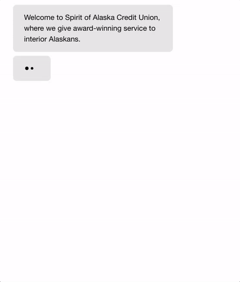

# Aurora Chat

Aurora is a simple conversational UI bot. You can create many types of conversations by editing a [JSON](http://json.org/)-like file with the conversation data.

## Demo

View live demo of [Aurora Chat here](https://aurora-chat.firebaseapp.com)



## Install

Run these commands to set up Aurora Chat (requires NPM and Bower):

```bash
git clone https://github.com/heyharmon/aurora-chat.git
cd aurora-chat
npm install
```

You need to run a local server using Node.js because Aurora Chat uses a jQuery GET HTTP request, ``$.getScript( "js/data.js", function( data )`` to load the data.js file containing the conversation data.

Serve up a local HTTP server (requires [http-server npm package](https://www.npmjs.com/package/http-server)) by running:

```bash
http-server
```

## Documentation

We use a fake JSON file as our conversation. You can find and edit this file in: ``js/data.js``

The file contains a conversation object with nodes indexed by a string (in our case numbers). A node can contain a bunch of stuff:

* "statement" (required) what our bot says. This can be a string, a array of strings or a function (with context) that returns an array of strings.
* "options" an array of options the user can choose. Each option is rendered as a button that the user can select (which they then also say as a response) and a "consequence" which is the next node we move to after.
* "input" will replace options and give the user an input field. What the user types is stored in the context under "name" and we then move to consequence.
* "sideeffect" a Javascript function that is executed at the start of a node. We use this mostly to set variables in the context but it could do anything.

## Tools

Built with [Zurb Foundation](http://foundation.zurb.com).


## Thank you
Thank you Hubbub for sharing your chatengine prototyper with the world (https://github.com/whatsthehubbub/chatengine). This chatengine prototype uses most of your original code.